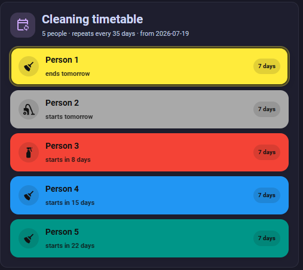
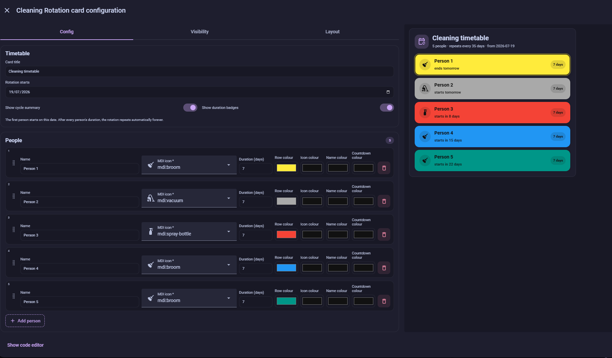

# Cleaning Rotation Card

A standalone Home Assistant dashboard card for a repeating cleaning rotation.
The timetable is stored directly in the card configuration, so it does not use
Home Assistant Calendar, helpers, scripts, or automations.




## Features

- automatic repeating rotation with no end date;
- independent duration in days for every person;
- configurable row, icon, name, and countdown colours for every person;
- configurable person name and MDI icon with Home Assistant suggestions;
- drag-and-drop rotation ordering in the visual editor;
- current person displayed first with an `ends in …` countdown;
- upcoming people displayed in rotation order with `starts in …` countdowns;
- optional cycle summary and duration badges;
- local-date calculations that remain stable across daylight-saving changes;
- responsive desktop and mobile layout.

## Install with HACS

1. Open **HACS** in Home Assistant.
2. Open the three-dot menu and select **Custom repositories**.
3. Add:

   ```text
   https://github.com/akugiz/cleaning-rotation-card
   ```

4. Select **Dashboard** as the repository type and press **Add**.
5. Find **Cleaning Rotation Card** in HACS and select **Download**.
6. Refresh Home Assistant with `Ctrl + Shift + R`.

Future versions will appear in Home Assistant under **Settings → System →
Updates** and in HACS.

## Manual installation

1. Download `cleaning-rotation-card.js`.
2. Copy it to:

   ```text
   /config/www/cleaning-rotation-card.js
   ```

3. Go to **Settings → Dashboards → Resources**.
4. Add this JavaScript module:

   ```text
   /local/cleaning-rotation-card.js?v=121
   ```

5. Refresh Home Assistant with `Ctrl + Shift + R`.

## Add the card

1. Edit a dashboard.
2. Select **Add card**.
3. Find **Cleaning Rotation**.
4. Choose the rotation start date.
5. Add people and set each person's name, colour, MDI icon, and duration.
6. Drag people by the grip handle to change the repeating order.

The first person begins on the selected start date. When their duration ends,
the second person begins, and so on. After the final person, the first person
starts again automatically.

## YAML example

```yaml
type: custom:cleaning-rotation-card
title: Cleaning timetable
start_date: "2026-07-22"
show_cycle_summary: true
show_duration: true
people:
  - id: person-one
    name: Person One
    icon: mdi:broom
    color: "#ffeb3b"
    icon_color: "#111111"
    name_color: "#111111"
    countdown_color: "#111111"
    duration: 7
  - id: person-two
    name: Person Two
    icon: mdi:vacuum
    color: "#a9a9a9"
    duration: 7
  - id: person-three
    name: Person Three
    icon: mdi:car
    color: "#f44336"
    duration: 7
  - id: person-four
    name: Person Four
    icon: mdi:controller-classic
    color: "#2196f3"
    duration: 7
  - id: person-five
    name: Person Five
    icon: mdi:cake-variant
    color: "#009688"
    duration: 7
```

## How repeating works

Durations are calendar days. For example, if three people have durations of
`7`, `5`, and `3` days, the complete cycle lasts 15 days and then repeats from
the first person. The card recalculates the current person from the start date,
so it continues correctly after Home Assistant restarts.

## Privacy

The card makes no internet requests. All names and timetable settings remain in
the Home Assistant dashboard configuration.
